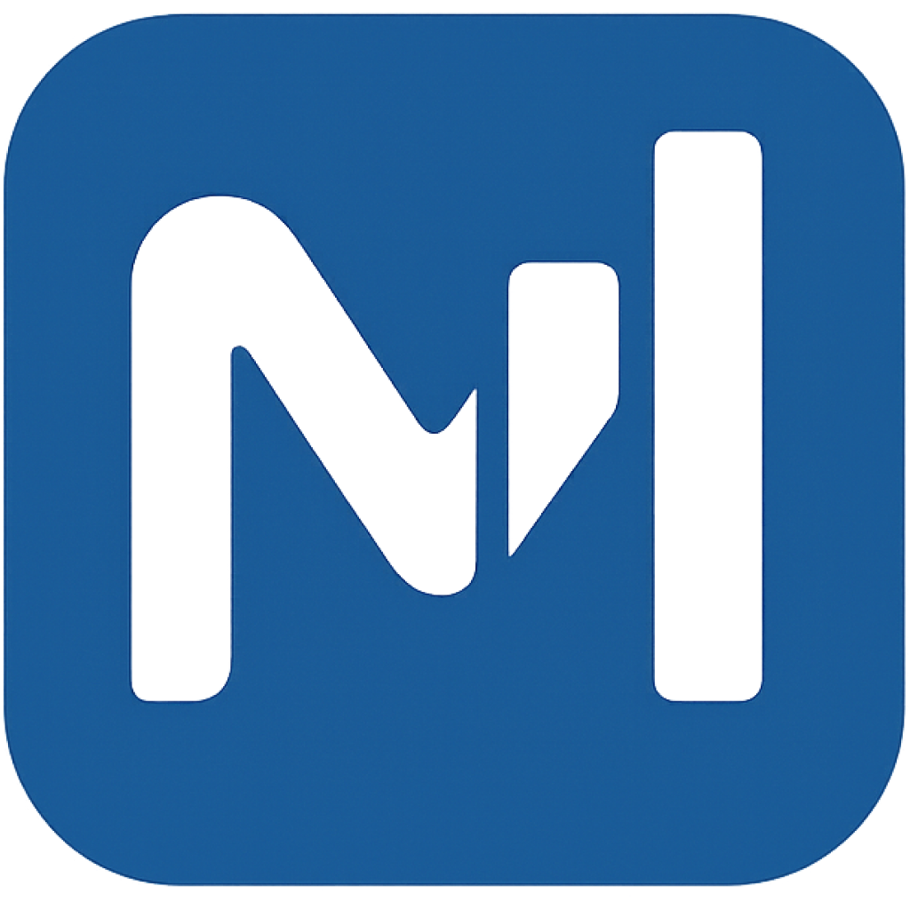

# 💰 Meta Finance

<p align="center">
  
</p>

<p align="center">
  <strong>O controle definitivo da sua liberdade financeira.</strong><br>
  <em>Privacidade absoluta, inteligência artificial e performance de ponta.</em>
</p>

<p align="center">
  
  
  
  
</p>

---

## 💎 Transforme sua Gestão Financeira

O **Meta Finance** não é apenas mais um gerenciador de finanças. É um ecossistema projetado para quem leva o patrimônio a sério. Unindo a agilidade da web com a robustez de uma aplicação desktop nativa, oferecemos uma experiência sem atritos, segura e totalmente privada.

### 🚀 Por que Meta Finance?

| 🛡️ **Privacidade Total** | ⚡ **Performance Nativa** | 🧠 **Insights Inteligentes** |
| :--- | :--- | :--- |
| Seus dados pertencem a você. Sincronização via Google Drive garante que nada saia do seu controle. | Construído com **Tauri v2**, entregando uma experiência ultra-leve e rápida no Windows. | Visualize seu futuro financeiro com dashboards dinâmicos e análises de alocação. |

---

## ✨ Funcionalidades Premium

### 📊 Dashboard de Comando
Visualize sua saúde financeira, patrimônio líquido e fluxos de caixa em tempo real com gráficos interativos de alta fidelidade.

### 📈 Gestão Profissional de Ativos
Acompanhe investimentos, rendimentos e a valorização do seu portfólio. Suporte para múltiplos ativos e rebalanceamento inteligente.

### 🎯 Metas e Conquistas
Defina objetivos de economia e desbloqueie conquistas conforme sua disciplina financeira evolui. 

<p align="center">
  
  
  
</p>

---

## 🛠️ Stack Tecnológica

Construído com o que há de mais moderno no desenvolvimento de software:

- **Core**: [React 19](https://react.dev/) + [Vite](https://vitejs.dev/)
- **Desktop Engine**: [Tauri v2](https://v2.tauri.app/) (Rust-powered performance)
- **Backend & Auth**: [Supabase](https://supabase.com/)
- **Visualização**: [Recharts](https://recharts.org/) & [Lucide Icons](https://lucide.dev/)
- **Styling**: Tailwind CSS & Glassmorphism design tokens

---

## 🖥️ Começando

### Instalação Web
1. Clone o repositório.
2. Instale as dependências: `npm install`
3. Configure o `.env.local` (veja `README.md` original para detalhes das chaves).
4. Rode: `npm run dev`

### Versão Desktop
Para uma experiência completa com integração ao sistema de arquivos e maior performance, utilize a versão Windows. O build é gerenciado via:
```powershell
npm run tauri build
```

---

<p align="center">
  <strong>Meta Finance App</strong> • Deixe seu dinheiro trabalhar para você.
</p>
